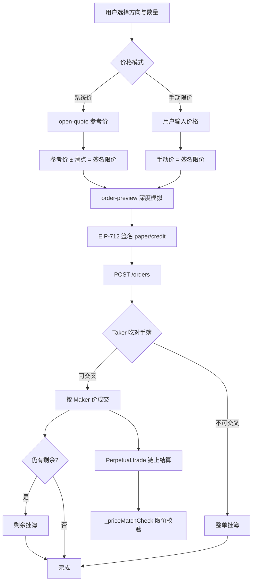

# 什么是限价单、市价单

> 面向：产品、前端、后端、测试与新手交易员。  
> 说明 **传统交易术语** 与 **MetaNode 永续合约实际实现** 的对应关系。  
> 相关文档：[滑点保护场景和方案.md](./滑点保护场景和方案.md) · [尝试撮合方案.md](./尝试撮合方案.md) · [撮合数据结构的技术方案.md](./撮合数据结构的技术方案.md)

---

## 1. 先读结论

| 问题 | 答案 |
|------|------|
| MetaNode 有独立的「市价单」类型吗？ | **没有**。API、数据库、链上合约里都不存在 `orderType = market` 字段。 |
| 那用户怎么「市价成交」？ | 前端 **系统价 + 滑点保护** 自动算出 **签名限价**，撮合引擎按限价吃簿；体验上接近市价单。 |
| 什么是本系统的「限价单」？ | 用户在 EIP-712 签名里锁定的 `paperAmount` / `creditAmount` 隐含价格；引擎只撮合 **不劣于该价格** 的对手档。 |
| 成交价格由谁决定？ | **Maker 价**（已在簿上的挂单价）；Taker 的签名限价只是 **上限/下限**，不是成交价。 |

一句话：**MetaNode 在协议层只有限价单；产品层的「市价」= 带滑点容忍的限价单。**

---

## 2. 传统交易所里的两个概念

### 2.1 限价单（Limit Order）

用户指定 **愿意成交的最差价格**：

- **买入限价**：「最高愿意出 X 买」——只有卖价 ≤ X 才成交，否则挂簿等待。
- **卖出限价**：「最低愿意以 Y 卖」——只有买价 ≥ Y 才成交，否则挂簿等待。

特点：**价格可控，成交不确定**（可能部分成交、可能完全不成交）。

### 2.2 市价单（Market Order）

用户 **不指定价格**（或指定极宽的价格边界），要求 **立刻按当前盘口成交**：

- **买入市价**：从卖一、卖二……依次吃单，直到数量满足。
- **卖出市价**：从买一、买二……依次吃单。

特点：**成交优先，价格不可精确预知**（存在滑点：实际均价可能偏离刚看到的报价）。

### 2.3 对比

| 维度 | 限价单 | 市价单 |
|------|--------|--------|
| 价格 | 用户明确指定 | 由当时盘口决定 |
| 成交速度 | 可能等待 | 通常立即（深度够时） |
| 滑点 | 成交价不会劣于限价 | 可能因深度不足而滑点 |
| 未成交部分 | 常挂簿继续等待 | 一般不要求挂簿（本所不同，见后文） |

---

## 3. MetaNode 的订单模型：签名即限价

本系统订单 **不区分 type 字段**，价格完全由签名里的两个数量决定。

### 3.1 链上 `Order` 结构

```solidity
// src/libraries/Types.sol
struct Order {
    address perp;
    address signer;
    int128 paperAmount;   // 仓位：正=做多，负=做空
    int128 creditAmount;  // 资金：与 paper 异号
    bytes32 info;         // 费率、过期时间、nonce
}
```

**隐含限价**（与后端、前端一致）：

```
price = |creditAmount| / |paperAmount|
```

精度：链上验证用 1e18 口径；前端构造 `credit` 时用 USDC 6 位小数。

### 3.2 方向与挂簿

| paperAmount | 含义 | 挂到哪一侧 |
|-------------|------|------------|
| **> 0** | 做多 / 买入 | 买盘 **bids** |
| **< 0** | 做空 / 卖出 | 卖盘 **asks** |

### 3.3 链上二次校验

结算时 `Trading._priceMatchCheck` 确保 Taker 不会在 **劣于自己签名限价** 的价格成交：

- Taker 买入：Maker 卖价不能高于 Taker 限价（等价于 `makerCredit × takerPaper ≤ takerCredit × makerPaper`）。
- Taker 卖出：Maker 买价不能低于 Taker 限价。

因此：**用户签名的 paper/credit 就是链上硬约束的限价**，没有单独的滑点字段。

---

## 4. 前端两种模式：如何对应「市价 / 限价」

前端 `OrderForm` 提供两种开仓价格模式（平仓默认走系统价逻辑）：

| UI 模式 | 用户感知 | 系统实际行为 |
|---------|----------|--------------|
| **系统价** | 类似「市价」：按当前合理价尽快成交 | 拉 `/open-quote` 得参考价 → 加滑点 → **签名限价** → 吃簿 |
| **限价**（手动） | 传统限价单：自己填价格 | 用户填写的价格 **直接作为签名限价**（需在滑点保护范围内） |

### 4.1 系统价模式（≈ 带保护的市价）

```
GET /api/v1/open-quote?perp=&side=long|short
    ↓
参考价 P_ref：做多 = 卖一，做空 = 买一（无盘口则 mid → 链 mark → 指数）
    ↓
签名限价 P_limit = P_ref ± slippageBps（默认 50 bps = 0.5%）
    ↓
GET /api/v1/order-preview  深度模拟（预估均价、成交量）
    ↓
EIP-712 签名（paper/credit 按 P_limit 构造）
    ↓
POST /api/v1/orders → 撮合
```

- **做多**：`P_limit = P_ref × (1 + bps/10000)` — 最高愿意买多贵。
- **做空**：`P_limit = P_ref × (1 - bps/10000)` — 最低愿意卖多便宜。

这与传统「市价单」的区别：**仍有明确的最差价**，由滑点滑块控制，而不是无限吃单。

### 4.2 手动限价模式（≈ 传统限价单）

用户自行输入价格（如 60000）。该价格 **原样写入** `buildOrderAmounts` 的 `priceUsd`，成为签名限价。

提交前会校验：手动价不得超出当前参考价的滑点容忍范围（否则提示调整滑点或价格）。

### 4.3 平仓

平仓无「手动/系统」切换，始终：

1. 按 **平仓方向** 拉 `open-quote`（平多 → 看买一，平空 → 看卖一）。
2. 应用相同滑点规则得到签名限价。
3. 数量 = 持仓数量，方向与持仓相反。

---

## 5. 撮合引擎：限价单如何被对待

实现：`internal/engine/matchengine.go`、`internal/engine/orderbook.go`。

### 5.1 新订单进入

```
POST /orders → 验签 → 写 DB → MatchEngine.AddOrder
    ↓
matchIncomingOrder：新单作为 Taker，先吃对手簿
    ↓
未成交部分 → insertResting 挂入本侧订单簿（仍是限价单）
```

### 5.2 价格交叉规则

Taker 限价 `takerPrice` 与 Maker 限价 `makerPrice` 可成交当且仅当：

| Taker 方向 | 条件 | 含义 |
|------------|------|------|
| 买入（paper > 0） | `makerPrice ≤ takerPrice` | 卖价不高于我愿意出的最高价 |
| 卖出（paper < 0） | `makerPrice ≥ takerPrice` | 买价不低于我愿意接受的最低价 |

代码：`bookSide.priceCrosses()`。

### 5.3 成交价

**始终取 Maker 价**（标准交易所规则）。Taker 的签名限价只决定 **能不能吃这一档**，不决定最终价。

示例：Taker 买入限价 61305，卖盘 61000 / 61100 有量 → 实际成交 61000、61100，**不会**吃到 61306。

### 5.4 部分成交与挂簿

| 场景 | 行为 |
|------|------|
| 深度充足 | 全部成交，不挂簿 |
| 深度不足 | 能成交的部分立即成交，**剩余量在限价内挂簿** |
| 价格不交叉 | 整单挂簿等待 |
| 自成交 | 同一 `signer` 的 Maker 跳过 |

「系统价」模式下若滑点内深度不够，未成交部分会像 **限价单** 一样留在簿上——这是与传统纯市价单的重要差异。

### 5.5 角色

| 角色 | 定义 |
|------|------|
| **Taker** | 新进入、主动吃单的订单 |
| **Maker** | 已在簿上、被动成交的挂单 |

---

## 6. 对照表：术语 → 本系统

| 传统说法 | MetaNode 实现 | 代码 / API |
|----------|---------------|------------|
| 限价单 | 签名 `paper`/`credit` 固定价格 | `buildMetaNodeOrder(priceUsd)` |
| 市价单（体验） | 系统价 + 滑点 → 签名限价 | `open-quote` + `slippage.ts` |
| 订单类型字段 | 无 | — |
| 参考价 | 卖一/买一 | `GET /open-quote` |
| 深度预览 | 模拟吃簿 | `GET /order-preview` |
| 最差可成交价 | 签名限价 | `LimitPriceWithSlippage` |
| 预估成交均价 | 加权模拟 | `SimulateTakerFill` |
| 挂簿 | 未成交剩余 | `insertRestingLocked` |
| 链上结算 | 批量 `Perpetual.trade()` | `submitLoop` |

---

## 7. 场景举例

### 场景 A：系统价开多（类似市价）

**订单簿 asks：** 61000 × 0.5，61100 × 0.5  
**操作：** 系统价开多 0.3 BTC，滑点 0.5%，卖一 61000  

- 签名限价 ≈ 61305  
- 成交 0.3 @ 61000（Maker 价），**优于** 61305  
- 全部成交，不挂簿  

### 场景 B：系统价开多但深度不足

**订单簿 asks：** 61000 × 0.1  
**操作：** 系统价开多 0.3 BTC，滑点 0.5%  

- 即时成交 0.1 @ 61000  
- **剩余 0.2 以限价 61305 挂入 bids**（若后续无更优卖单则等待）  

### 场景 C：手动限价开多

**操作：** 限价 59000 买入 0.1 BTC  

- 当前卖一 61000 → 价格不交叉 → **整单挂买盘**  
- 直到有人卖价 ≤ 59000 才成交  

### 场景 D：手动限价「穿透」盘口

**订单簿 asks：** 60000 × 0.2，61000 × 0.2  
**操作：** 限价 61500 买入 0.3 BTC  

- 先吃 60000 档 0.2，再吃 61000 档 0.1  
- 成交价 60000 / 61000，**不会**按 61500 成交  

---

## 8. 常见问题

### Q1：为什么不做真正的市价单？

1. **链上可验证**：EIP-712 必须包含确定的价格边界，合约才能拒绝更差价成交。  
2. **用户保护**：无边界市价在薄盘口或异常波动时风险极大。  
3. **架构统一**：撮合引擎、WAL、恢复逻辑只需处理一种订单语义。

### Q2：系统价和标记价（Mark Price）一样吗？

不一样。**系统价**（`open-quote`）优先 **对手盘最优价**（做多看卖一）；**标记价**用于展示、资金费、风控，可能来自 mid、链上 mark 或指数。无盘口时 open-quote 才会回退到 mark / 指数。

### Q3：杠杆影响成交价吗？

**不影响。** 杠杆只影响前端展示的 **占用保证金**；撮合与链上结算仍按 **限价 × 数量** 的全额名义价值进行（见 `OrderForm` 提示文案）。

### Q4：如何理解「滑点保护」与「限价单」的关系？

滑点保护 **不是第三种订单类型**，而是 **系统价模式下自动计算签名限价的规则**。手动限价模式下，用户自己填的就是签名限价（受滑点范围校验约束）。

### Q5：和传统 CEX 的 Post-Only / IOC / FOK？

当前 **未实现** Post-Only、IOC、FOK 等 Time-in-Force 变体。所有订单默认：**先吃簿，剩余挂簿，直到过期或撤单**（默认 TTL 1 小时，见 `ORDER_TTL_SEC`）。

---

## 9. 端到端流程（简图）



---

## 10. 代码索引

| 模块 | 路径 |
|------|------|
| 链上订单与价格校验 | `src/libraries/Types.sol`、`src/libraries/Trading.sol` |
| 撮合引擎 | `others/backend/internal/engine/matchengine.go` |
| 订单簿 | `others/backend/internal/engine/orderbook.go` |
| 深度模拟 | `others/backend/internal/engine/fillsim.go` |
| 参考价 / 滑点 | `others/backend/internal/logic/market/markprice.go`、`slippage.go` |
| 下单 API | `POST /api/v1/orders` |
| 预览 API | `GET /api/v1/order-preview` |
| 前端下单 | `others/fe/components/OrderForm.tsx` |
| 签名构造 | `others/fe/lib/metanode-order.ts`、`others/fe/lib/slippage.ts` |

---

## 11. 延伸阅读

- [滑点保护场景和方案.md](./滑点保护场景和方案.md) — 系统价模式的公式与数字例题  
- [尝试撮合方案.md](./尝试撮合方案.md) — Taker/Maker、过滤规则、API 列表  
- [撮合数据结构的技术方案.md](./撮合数据结构的技术方案.md) — 订单簿内存结构与 walkthrough 图  
- 图示：`docs/diagrams/match-walkthrough.svg` — 多档吃单示意  
