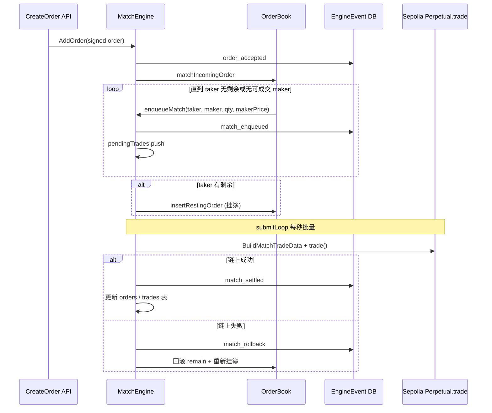

# 尝试撮合方案

> MetaNode 永续合约后端内存撮合引擎设计说明。  
> 实现代码：`internal/engine/matchengine.go`  
> 配置：`etc/metanode.yaml` → `MatchEngine`

---

## 1. 目标

在 **Sepolia 链上 MetaNodeDealer** 体系下，实现一套可运行的 **限价订单簿撮合**：

| 能力 | 说明 |
|------|------|
| 接收签名订单 | HTTP `POST /api/v1/orders`，校验 EIP-712 |
| 内存撮合 | 价格-时间优先，生成成交 |
| 链上结算 | 批量调用 `Perpetual.trade` |
| 深度展示 | `GET /api/v1/orderbook` |
| 崩溃恢复 | DB 订单 + Engine Event 日志回放 |
| 多实例 | Redis Leader 选主，单活跃撮合节点 |

---

## 2. 订单语义

### 2.1 方向与价格

- **paper > 0**：做多（买单），挂 **BuyOrders**
- **paper < 0**：做空（卖单），挂 **SellOrders**
- **限价** = `|credit| / |paper|`，精度 1e18（与链上一致）

```go
// calculatePrice: price = |credit| * 1e18 / |paper|
```

### 2.2 角色

| 角色 | 定义 |
|------|------|
| **Taker** | 新进入、主动吃单的订单 |
| **Maker** | 已在簿上、被动成交的挂单 |

成交价格取 **Maker 价**（标准交易所规则）。

### 2.3 过滤规则

- **自成交禁止**：`taker.Signer == maker.Signer` 跳过
- **过期订单**：`expiration <= now` 从簿中剔除，状态改 Cancelled
- **价格交叉**：买价 ≥ 卖价（或 taker 限价可覆盖 maker 价）才成交

---

## 3. 核心数据结构

### 3.1 总览

```
MatchEngine
├── orderBooks: map[perpAddress] → OrderBook     // 每个合约一本簿
├── remain:     map[orderId] → *big.Int          // 剩余可撮合数量（paper 绝对值）
├── pendingTrades: []*MatchResult                // 待上链成交队列
├── eventQueue: chan *EngineEvent                // Leader 事件循环
└── Redis Leader Lock                            // 多实例选主
```

### 3.2 OrderBook（价档 + FIFO 队列，已实现）

实现文件：`internal/engine/orderbook.go`

```go
OrderBook
├── bids / asks: bookSide
│   ├── levels: map[priceKey] → priceLevel
│   ├── head: *priceLevel          // 最优价档双向链表
│   └── priceLevel:
│       ├── queue: FIFO (list.List) // 同价按 CreateTime 优先
│       └── totalRem                // 档内剩余量聚合（深度 O(N)）
└── entries: map[orderId] → bookEntry  // O(1) 撤单 / 改量
```

**排序规则**（与原先 `bookOrderLess` 一致）：

1. 价档：买单降序 / 卖单升序（链表插入 O(P)，P=价档数）
2. 同价队列：CreateTime 升序 → OrderId 字典序
3. 深度快照：沿链表取前 N 档，直接用 `totalRem`

| 操作 | 复杂度 |
|------|--------|
| 挂单 | O(P) 找/插价档 + O(k) 同价队列插入 |
| 撤单 | **O(1)**（entries 索引 + list 删除） |
| 撮合连吃 k 笔 | **O(k)** 队首 + 自成交 skip |
| 深度 N 档 | **O(N)** |

### 3.3 MatchResult（成交记录）

```go
type MatchResult struct {
    MatchID     string
    TakerOrder  *model.Order
    MakerOrder  *model.Order
    MatchAmount string  // 成交 paper 绝对值
    MatchPrice  string  // maker 限价
}
```

### 3.4 Engine Event（WAL 事件日志）

持久化到 DB，支持 Leader 切换与重启回放：

| EventType | 含义 |
|-----------|------|
| `order_accepted` | 新单入簿 |
| `order_canceled` | 撤单 |
| `match_enqueued` | 生成待结算成交 |
| `match_settled` | 链上提交成功 |
| `match_rollback` | 链上失败，内存回滚 |

---

## 4. 撮合流程

### 4.1 新单进入（主路径）

```
CreateOrder API
    → 验签 + 写 orders 表
    → MatchEngine.AddOrder(order)
        → appendOrderEvent (WAL)
        → eventQueue → eventLoop
            → matchIncomingOrder(taker, remain)
```

**`matchIncomingOrder` 伪代码：**

```
1. 取 perp 对应 OrderBook
2. 清理过期单
3. matchAgainstRestingLocked:
   - taker 为买单 → 从 SellOrders[0..] 依次找可成交 maker
   - taker 为卖单 → 从 BuyOrders[0..] 依次找可成交 maker
   - fillQty = min(takerRemaining, makerRemaining)
   - enqueueMatch → pendingTrades + WAL
4. 若 taker 仍有剩余 → insertRestingOrderLocked 挂入簿
```

### 4.2 定时交叉撮合（辅路径）

除新单主动吃簿外，`eventLoop` 每隔 `MatchInterval`（默认 100ms）调用 `match()`：

- 对每本簿取 **最优买** 与 **最优卖**
- 若 `buyPrice >= sellPrice` 且非同用户 → 成交
- 较老订单作 taker（`orderOlder`）
- 循环直到无法交叉

用于：簿内已有挂单后行情变动、或事件顺序导致的漏撮合补全。

### 4.3 流程图



---

## 5. 撮合优先级规则

| 优先级 | 规则 |
|--------|------|
| 1 | **价格优先**：买单高价优先；卖单低价优先 |
| 2 | **时间优先**：同价按 `CreateTime` 先到先成交 |
| 3 | **Maker 价成交** | 成交价 = 被动单价格 |
| 4 | **部分成交** | 双方 `remain` 递减；为 0 移出簿 |
| 5 | **禁止自成交** | 同一 `signer` 不匹配 |

---

## 6. 链上结算

### 6.1 提交流程

- `submitLoop`：每 **1 秒** 从 `pendingTrades` 取最多 `BatchSize`（默认 10）笔
- `chain.BuildMatchTradeData(taker, maker, ...)` 编码 calldata
- 发送交易 → 等收据
- 成功：`match_settled`，更新 `orders.filled_amount`、`trades` 表
- 失败：`match_rollback`，内存恢复 `remain` 并 reinsert 挂簿

### 6.2 前置条件

- 配置 `Ethereum.PrivateKey` 对应地址必须是链上 `validOrderSender`
- RPC 稳定可用

---

## 7. 订单簿快照（API 用）

撮合结构与展示结构 **分离**：

| 层 | 结构 | 用途 |
|----|------|------|
| 撮合层 | `[]*Order` 有序列表 | 插入、删除、撮合 |
| 展示层 | `map[price] → aggregatedQty` | `SnapshotOrderBook(perp, limit)` |

`MidMarkPrice`：有买卖双边 → `(bestBid + bestAsk) / 2`；单边 → 取最优价。

---

## 8. 高可用与恢复

### 8.1 Redis Leader

- Key：`metanode:match-engine:leader`
- TTL：15s，每 5s 续租
- 仅 Leader 执行：撮合、上链、消费 event

### 8.2 启动恢复

1. `RestorePendingOrders`：从 DB 加载 `pending` / `partial_fill` 且未过期订单
2. 回放 `EngineEvent` 日志到内存簿
3. `restoreUnresolvedMatches`：补处理未 settled 的 match

---

## 9. 数据结构选型对比

### 9.1 当前方案（价档 + FIFO，已上线于 engine）

```
map[perp] → OrderBook { 价档链表 + FIFO + entries 索引 }
```

| 优点 | 缺点 |
|------|------|
| 撤单 O(1)、深度 O(N) | 价档链表插入 O(P) |
| 同价时间优先 | P 很大时仍可换 BTree |
| 无全局 remain map，数据内聚 | — |

### 9.2 进一步升级（按需）

若价档数 P 也达到数千，可将 `head` 链表换为 `BTreeMap<Price, PriceLevel>`。

---

## 10. 配置参考

```yaml
MatchEngine:
  MatchInterval: 100          # 定时交叉撮合间隔 ms
  BatchSize: 10               # 每批上链笔数
  MaxPendingOrders: 10000
  LeaderLockKey: "metanode:match-engine:leader"
  LeaderLockTTLSeconds: 15
  LeaderRenewSeconds: 5
  EventPollIntervalMs: 200
```

---

## 11. 相关 API

| 方法 | 路径 | 与撮合关系 |
|------|------|------------|
| POST | `/api/v1/orders` | 下单 → 入簿撮合 |
| GET | `/api/v1/orderbook?perp=` | 读内存深度快照 |
| GET | `/api/v1/trades?perp=` | 历史成交 |
| GET | `/api/v1/open-quote?perp=&side=` | 系统开仓价（卖一/买一） |
| DELETE | `/api/v1/orders/:id` | 撤单 → RemoveOrder |

---

## 12. 测试

单元测试：`internal/engine/matchengine_test.go`

覆盖：

- 买卖交叉撮合
- Event 日志回放与 Leader 恢复
- 部分成交 / remain 递减

运行：

```bash
cd others/backend
go test ./internal/engine/... -v -run Match
```

---

## 13. 后续可优化项

1. **价格树 + FIFO 队列**：降低插入/撤单复杂度
2. **FOK / IOC 订单类型**：当前为限价 GTC 语义
3. **撮合与上链解耦**：pending 队列持久化，避免链上失败仅内存回滚
4. **WebSocket 推送**：成交 / 深度变更实时推前端
5. **mark price 与撮合联动**：fair mark 来自订单簿 mid（部分已在 `MidMarkPrice` 实现）

---

## 14. 关键代码索引

| 文件 | 职责 |
|------|------|
| `internal/engine/orderbook.go` | 价档 + FIFO 订单簿 |
| `internal/engine/matchengine.go` | 撮合引擎主体 |
| `internal/logic/order/createorderlogic.go` | 下单入口 |
| `internal/logic/order/cancelorderlogic.go` | 撤单 |
| `internal/chain/tradedata.go` | 链上 trade 编码 |
| `internal/logic/market/getorderbooklogic.go` | 深度 API |
| `internal/model/order.go` | 订单模型与状态 |
