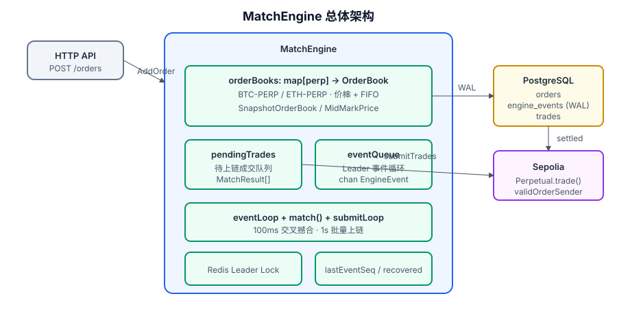
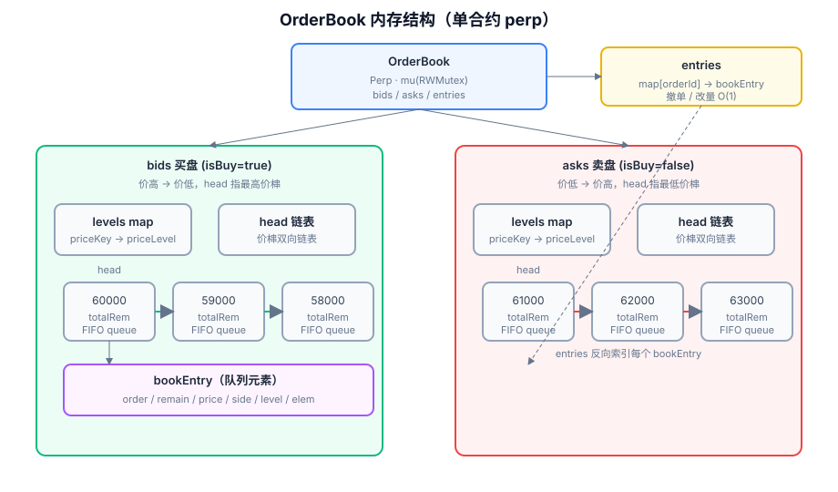
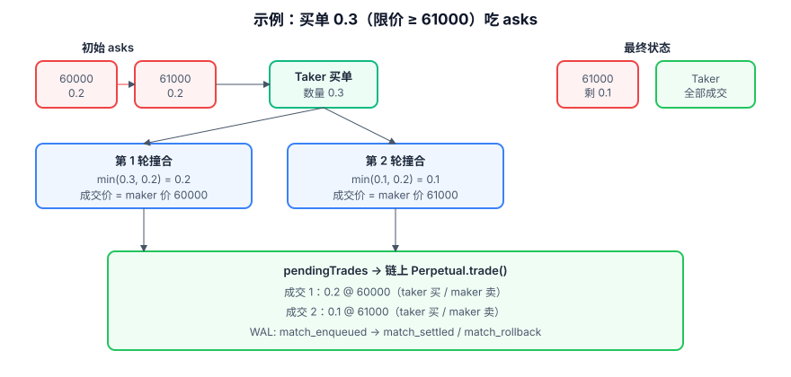
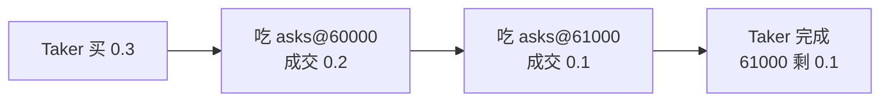
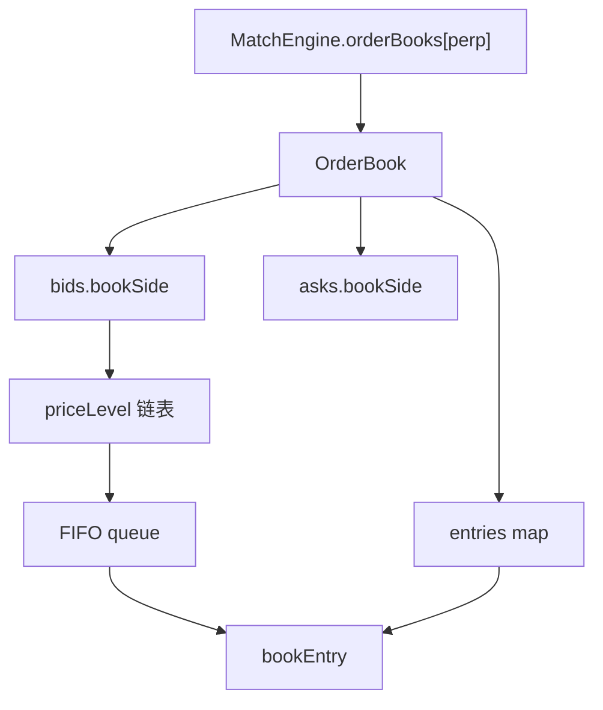

# 撮合数据结构的技术方案

> MetaNode 永续合约后端 **内存订单簿** 数据结构说明。  
> 面向：后端开发、前端对接、测试与运维。  
> 实现代码：`internal/engine/orderbook.go`、`internal/engine/matchengine.go`  
> 延伸阅读：[尝试撮合方案.md](./尝试撮合方案.md)（流程、HA、配置）

---

## 1. 设计目标

| 目标 | 说明 |
|------|------|
| 价格-时间优先 | 买高价优先、卖低价优先；同价按 `CreateTime` FIFO |
| 低延迟撮合 | 热路径在内存完成，链上仅批量结算 |
| O(1) 撤单 | 通过 `orderId` 索引直达队列节点 |
| 深度可读 | 按价档聚合 `totalRem`，API O(N) 输出 N 档 |
| 可恢复 | DB 订单 + `engine_events` WAL 回放 |

---

## 2. 总体架构



```
MatchEngine
├── orderBooks      map[perpAddress] → *OrderBook    // 每合约一本簿
├── pendingTrades   []*MatchResult                    // 待上链成交
├── eventQueue      chan *EngineEvent                 // Leader 消费 WAL
├── lastEventSeq    int64                             // 已回放事件序号
└── Redis Leader    多实例选主，仅 Leader 撮合/上链
```

**数据流简述：**

1. `POST /api/v1/orders` → 验签 → 写 `orders` 表 → `AddOrder`
2. `AddOrder` 写 `engine_events`（`order_accepted`）→ 事件循环 → `matchIncomingOrder`
3. 撮合产生 `MatchResult` → `pendingTrades` + WAL（`match_enqueued`）
4. `submitLoop` 每秒批量 `Perpetual.trade()` → 成功 `match_settled` / 失败 `match_rollback`

---

## 3. OrderBook：三层结构



每个永续合约地址（`perp`）对应 **一本** `OrderBook`，内部 **买盘 bids** 与 **卖盘 asks** 对称，共用一套 **订单索引 entries**。

### 3.1 类型定义（与代码一致）

```go
// orderbook.go

type OrderBook struct {
    Perp    string
    bids    *bookSide              // 买盘
    asks    *bookSide              // 卖盘
    entries map[string]*bookEntry  // orderId → 条目（O(1) 撤单）
    mu      sync.RWMutex
}

type bookSide struct {
    isBuy  bool                      // true=买, false=卖
    book   *OrderBook
    levels map[string]*priceLevel    // priceKey → 价档
    head   *priceLevel               // 最优价档（双向链表头）
}

type priceLevel struct {
    priceKey string
    price    *big.Int                // 限价 = |credit|/|paper| (1e18)
    totalRem *big.Int                // 该档剩余量合计（深度 API 用）
    queue    *list.List               // 同价 FIFO，元素为 *bookEntry
    prev, next *priceLevel           // 价档有序链表
}

type bookEntry struct {
    order  *model.Order
    remain *big.Int                  // 剩余可撮合 paper 绝对值
    price  *big.Int
    side   *bookSide
    level  *priceLevel
    elem   *list.Element              // 在 queue 中的位置（O(1) 删除）
}
```

### 3.2 为什么用「价档 + FIFO + 索引」？

| 层级 | 结构 | 解决的问题 |
|------|------|------------|
| **价档链表** | `head` + `prev/next` | 价格优先：买从高到低、卖从低到高遍历 |
| **同价 FIFO** | `list.List` | 时间优先：同价位先到先成交 |
| **entries** | `map[orderId]` | 撤单、部分成交改量无需扫描全书 |
| **levels** | `map[priceKey]` | 同价追加 O(1) 找到已有价档 |
| **totalRem** | 每档聚合 | 深度接口直接读档级数量 |

> 不使用单一全局 `remain map`：剩余量内聚在 `bookEntry.remain`，与队列位置绑定，避免双份状态不一致。

### 3.3 排序规则

**价档顺序（`bookSide.isBetter`）：**

- **bids**：价格 **降序**（60000 → 59000 → …），`head` = 最高买价
- **asks**：价格 **升序**（61000 → 62000 → …），`head` = 最低卖价

**同价队列（`entryTimeBefore`）：**

1. `CreateTime` 升序（先到优先）
2. 相同则 `Id` / `OrderId` 字典序

**限价计算：**

```go
price = |creditAmount| * 1e18 / |paperAmount|
```

- `paper > 0` → 买单 → 挂 **bids**
- `paper < 0` → 卖单 → 挂 **asks**

---

## 4. 指针关系（一图读懂）

```
                    OrderBook
                        │
        ┌───────────────┼───────────────┐
        │               │               │
     entries          bids            asks
        │               │               │
        │          levels + head    levels + head
        │               │               │
        └──────► bookEntry ◄──── level.queue (FIFO)
                    │
              order / remain / elem
```

**挂单一笔订单时：**

1. 根据 `paper` 符号选 `bids` 或 `asks`
2. `levels[priceKey]` 不存在 → `insertLevel` 插入价档链表
3. `enqueue` 将 `bookEntry` 放入该档 `queue`
4. `entries[orderId] = entry`，`totalRem += remain`

**撤单时：**

1. `entries[orderId]` → `bookEntry`
2. `side.detach(entry)`：`queue.Remove(elem)`，空档则 `removeLevel`
3. `delete(entries, orderId)`

---

## 5. 撮合逻辑与数据结构交互

### 5.1 主路径：新单作 Taker

`matchIncomingOrder` → `matchAgainstRestingLocked`：

```go
for takerRemaining > 0 {
    maker := nextMatchableMakerLocked(taker, takerPrice, takerIsBuy)
    matchAmount := min(takerRemaining, makerRemaining)
    enqueueMatch(taker, maker, matchAmount, calculatePrice(maker))  // 成交价 = maker 价
    takerRemaining -= matchAmount
    applyFillLocked(maker.OrderId, matchAmount)   // 只扣 maker；taker 尚未入簿
}
if takerRemaining > 0 {
    insertRestingLocked(taker, takerRemaining)    // 剩余挂簿
}
```

**`nextMatchableMakerLocked` 找对手方：**

- Taker **买** → 扫 **asks**，从 `head`（最低卖价）沿 `next` 价档向上
- Taker **卖** → 扫 **bids**，从 `head`（最高买价）沿 `next` 价档向下
- 价档内从 `queue.Front()` 起，跳过自成交（同 `signer`）
- 价格交叉：买 `makerAsk <= takerBid`；卖 `makerBid >= takerAsk`

### 5.2 辅路径：定时交叉撮合

`eventLoop` 每 `MatchInterval`（默认 100ms）调用 `matchOrderBook`：

- 取 `bestCrossPairLocked()`：最优买 vs 最优卖
- 若 `bidPrice >= askPrice` 且非同用户 → 成交
- **较老订单** 作 taker（`orderOlder`），成交价 = maker 价

用于：簿内已有挂单后补全漏撮合。

### 5.3 撮合示例



**场景：** asks 有 60000×0.2、61000×0.2；新来 **买单 0.3**，限价 ≥ 61000。

| 轮次 | Taker 剩余 | Maker | 成交量 | 成交价 |
|------|-----------|-------|--------|--------|
| 1 | 0.3 | asks@60000 (0.2) | 0.2 | **60000** |
| 2 | 0.1 | asks@61000 (0.2) | 0.1 | **61000** |

结果：Taker 全部成交；61000 档剩 **0.1**；产生 2 笔 `MatchResult` 进入 `pendingTrades`。

若买价仅 **60000**：只成交 0.2@60000，剩余 **0.1** 挂入 bids@60000。

### 5.4 撮合优先级（汇总）

| 优先级 | 规则 |
|--------|------|
| 1 | **价格优先**：买吃最低卖起；卖吃最高买起 |
| 2 | **时间优先**：同价 FIFO |
| 3 | **Maker 价成交** | 被动单价格 |
| 4 | **部分成交** | `remain` 递减，为 0 移出簿 |
| 5 | **禁止自成交** | 同 `signer` 跳过 |

---

## 6. MatchResult 与 WAL 事件

### 6.1 内存成交结构

```go
type MatchResult struct {
    MatchID     string
    TakerOrder  *model.Order
    MakerOrder  *model.Order
    MatchAmount string   // paper 绝对值
    MatchPrice  string   // maker 限价字符串
}
```

### 6.2 Engine Event（持久化 WAL）

| EventType | 触发时机 | 内存/DB 效果 |
|-----------|----------|--------------|
| `order_accepted` | 新单入簿 | 回放时 `matchIncomingOrder` |
| `order_canceled` | 撤单 | `removeOrderInMemory` |
| `match_enqueued` | 撮合成功 | 进入 `pendingTrades` |
| `match_settled` | 链上 tx 成功 | 写 `trades`，更新 `orders.filled_amount` |
| `match_rollback` | 链上 revert | 内存恢复 `remain`，重新挂簿 |

表：`engine_events`（Postgres），`id` 单调递增作 `seq`。

---

## 7. 操作复杂度

| 操作 | 复杂度 | 说明 |
|------|--------|------|
| 新价档挂单 | O(P) | P = 价档数；沿链表 `insertLevel` |
| 已有价档挂单 | O(k) | k = 同价单数；`enqueue` 维护时间序 |
| 撤单 | **O(1)** | `entries` + `list.Remove` |
| 吃单 k 笔 | **O(k + skip)** | 沿最优价档 + 队首；skip = 自成交跳过 |
| 深度 N 档 | **O(N)** | 沿 `head` 读 `totalRem` |
| 查 remain | **O(1)** | `entries[orderId].remain` |

当前 Sepolia 演示场景 P、k 通常较小；价档数上千时可考虑 BTree/跳表替代价档链表（见 [尝试撮合方案.md §9](./尝试撮合方案.md)）。

---

## 8. 与 API / 展示的边界

| 层 | 数据结构 | 用途 |
|----|----------|------|
| **撮合层** | `OrderBook` 价档 + FIFO | 插入、删除、撮合 |
| **展示层** | `snapshotLevels(limit)` | `GET /orderbook` 聚合深度 |
| **定价层** | `MidMarkPrice` | 双边 mid 或单边最优价 |

深度返回的是 **价档聚合**（每档 `totalRem`），不是逐笔订单明细。

---

## 9. 并发与多实例

- 每本 `OrderBook` 有 `sync.RWMutex`；撮合路径持 **写锁**
- `MatchEngine.orderBooks` 有全局 `mu`（创建 perp 簿时）
- 多实例：**Redis Leader** 仅 Leader 执行撮合、消费 event、上链
- Standby 通过轮询 `engine_events` 同步（`EventPollIntervalMs` 默认 200ms）

---

## 10. 启动恢复

1. Leader 获得锁 → `recoverLeaderState`
2. `RestorePendingOrders`：DB 中 `pending` / `partial_fill` 且未过期 → `insertResting`
3. 回放 `engine_events` 至 `lastEventSeq`
4. `restoreUnresolvedMatches`：补处理未 `settled` 的 `match_enqueued`

---

## 11. 关键代码索引

| 文件 | 职责 |
|------|------|
| `internal/engine/orderbook.go` | OrderBook、价档、FIFO、深度快照 |
| `internal/engine/matchengine.go` | MatchEngine、撮合、上链、Leader |
| `internal/logic/order/createorderlogic.go` | HTTP 下单入口 |
| `internal/logic/market/getorderbooklogic.go` | 深度 API |
| `internal/model/pgstore.go` | `orders` / `engine_events` / `trades` GORM |
| `internal/engine/matchengine_scenarios_test.go` | 18 个场景单测 |

**运行测试：**

```bash
cd others/backend
go test ./internal/engine/... -v -count=1
```

---

## 12. 附录：Mermaid 快速参考

### 12.1 新买单吃 asks



### 12.2 数据结构嵌套



---

## 13. 滑点保护（已实现）

限价 EIP-712 签名即链上硬顶/硬底；滑点保护在此基础上增加 **参考价 + 容忍度 → 签名限价** 与 **深度模拟**。

| 环节 | 实现 |
|------|------|
| 参考价 | `GET /open-quote`：做多=卖一，做空=买一 |
| 签名限价 | `limit = ref × (1 ± slippageBps/10000)`（`LimitPriceWithSlippage`） |
| 深度模拟 | `GET /order-preview?perp&side&size&slippageBps` → 逐档吃单预估 |
| 前端 | `OrderForm` 滑点预设 0.1%/0.5%/1%/3%，展示签名限价与预估均价 |
| 链上 | `Trading._priceMatchCheck` 二次校验，成交价不得劣于签名限价 |

前端库：`others/fe/lib/slippage.ts`；后端模拟：`internal/engine/fillsim.go`。  
**教学文档（场景与 FAQ）：** [滑点保护场景和方案.md](./滑点保护场景和方案.md)

---

## 14. 相关文档

- [尝试撮合方案.md](./尝试撮合方案.md) — 端到端流程、配置、HA、优化路线
- 图示源文件：`docs/diagrams/*.svg`（可用浏览器或 IDE 直接预览）
