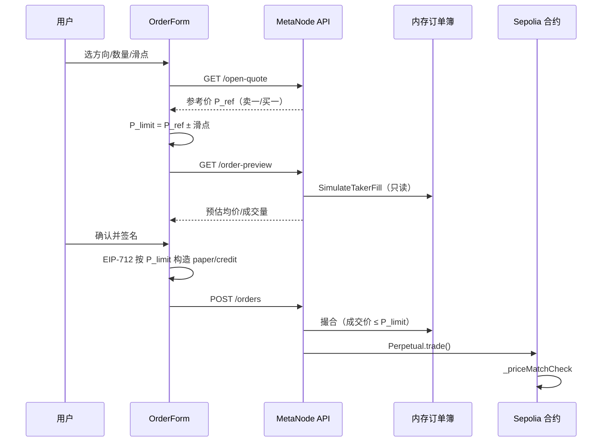

# 滑点保护：场景与方案（教学文档）

> 面向：产品、前端、后端、测试与新手交易员。  
> 说明 MetaNode 永续合约 **为何需要滑点保护、如何工作、典型场景怎么算**。  
> 相关实现：[撮合数据结构的技术方案.md](./撮合数据结构的技术方案.md) · [尝试撮合方案.md](./尝试撮合方案.md)

---

## 1. 先搞清三个概念

| 概念 | 在本项目中的含义 |
|------|------------------|
| **参考价** | 下单瞬间的「合理对手价」：做多看 **卖一**，做空看 **买一**（来自 `/open-quote`） |
| **签名限价** | 用户 EIP-712 签名里锁定的价格上限/下限；**链上绝不会比它更差** |
| **滑点** | 参考价与最终成交均价之间的偏差；保护目标是 **负向滑点不超过用户设定容忍度** |

本系统 **没有单独的「市价单」**，也 **没有链上 `maxSlippage` 字段**。  
滑点保护 = 用 **参考价 ± 容忍度** 算出 **签名限价**，再交给限价订单簿撮合。

---

## 2. 为什么需要滑点保护？

### 2.1 没有保护时会发生什么

用户在前端看到「系统价 61000」，直接按 61000 签名。若提交前卖盘被吃光、卖一跳到 62000：

- 订单仍按限价 61000 挂单 → **可能完全不成交**
- 或用户手动填 65000「确保成交」→ **可能在 62000～65000 任意价成交**，负向滑点不可控

### 2.2 保护方案的核心思想

```
参考价（当前卖一/买一）
    ↓  加上用户选的滑点容忍（如 0.5%）
签名限价（做多向上放宽，做空向下放宽）
    ↓  撮合引擎只吃 ≤ 限价的对手档
实际成交（按 Maker 价，通常优于签名限价）
    ↓  链上 Trading._priceMatchCheck 再验一遍
链上结算
```

用户得到的是：

1. **可预期的最差价格**（签名限价）
2. **提交前的深度模拟**（预估均价、能成交多少）
3. **链上硬约束**（合约拒绝更差价成交）

---

## 3. 公式与默认值

### 3.1 签名限价

设参考价为 `P_ref`，滑点为 `bps`（basis points，1 bps = 0.01%）：

| 方向 | 签名限价 | 含义 |
|------|----------|------|
| **做多（买）** | `P_limit = P_ref × (1 + bps/10000)` | 最高愿意买多贵 |
| **做空（卖）** | `P_limit = P_ref × (1 - bps/10000)` | 最低愿意卖多便宜 |

**示例：** 卖一 61000，滑点 50 bps（0.5%）

- 做多签名限价 = 61000 × 1.005 = **61305**
- 意味着：可以吃到 61000、61100、61305 的卖单，**不会**吃到 61306 及以上的卖单

### 3.2 默认参数（当前实现）

| 参数 | 值 |
|------|-----|
| 默认滑点 | **50 bps（0.5%）** |
| 前端预设 | 0.1% / 0.5% / 1% / 3% |
| 最大滑点 | 5000 bps（50%） |
| 持久化 | 浏览器 `localStorage` 键 `metanode_slippage_bps` |

代码位置：

- 前端：`others/fe/lib/slippage.ts`
- 后端：`others/backend/internal/logic/market/slippage.go`

---

## 4. 端到端流程



---

## 5. 场景教学（带数字）

以下用 **USDT 计价**，数量为 **BTC**，简化忽略手续费。

### 场景 A：系统价开多，深度充足 —— 价格改善

**订单簿 asks（卖盘）：**

| 价格 | 数量 |
|------|------|
| 60000 | 0.2 |
| 61000 | 0.2 |

**用户：** 做多 0.3 BTC，参考卖一 61000，滑点 0.5% → 签名限价 **61305**

**撮合过程：**

| 轮次 | 吃档 | 成交量 | 成交价（Maker） |
|------|------|--------|-----------------|
| 1 | 60000 | 0.2 | 60000 |
| 2 | 61000 | 0.1 | 61000 |

**结果：**

- 全部成交 0.3
- 加权均价 ≈ **60333**（优于限价 61305）
- 这是 **价格改善**，不是负滑点

---

### 场景 B：签名限价过低 —— 部分成交 + 挂簿

仍用场景 A 的 asks，但用户只给滑点 **0%**（或手动限价 **61000**）：

- 第 1 档 60000 成交 0.2
- 61000 档：61000 ≤ 61000 ✓，再成交 0.1… 若限价严格等于 61000 且可交叉则全成
- 若限价 **60500**：只吃 60000 的 0.2，**剩余 0.1 挂 bid@60500 等待**

前端 `/order-preview` 会显示：`filledSize=0.2, unfilledSize=0.1`

---

### 场景 C：深度不足 —— 在限价内能成交多少算多少

**asks：** 60000×0.1，61000×0.1  
**用户：** 买 0.5，限价 61305

- 仅成交 0.2，**0.3 未成交**
- 未成交部分：作为 **Taker 剩余** 挂入 bids（限价单语义）
- 前端提示：「剩余 0.3 将在限价内挂簿等待」

---

### 场景 D：做空平仓 —— 参考价取买一

持有多仓 0.01 BTC，点击平仓 → 系统生成 **做空** 平仓单：

- 参考价 = **买一**（不是标记价）
- 签名限价 = 买一 × (1 - 滑点)
- 从 **bids 最高价** 开始吃单

这样平仓与开仓逻辑对称，避免用 mark 价签名导致与盘口脱节。

---

### 场景 E：手动限价超出滑点 —— 前端拦截

用户选手动限价，填 62000，但参考卖一 61000、滑点 0.5%（上限 61305）：

- 62000 > 61305 → **前端拒绝提交**
- 提示：手动限价超出滑点保护，请提高滑点或降价

手动模式仍允许更 **保守** 的限价（如 60500），只是不能比保护上限更 **激进**。

---

### 场景 F：链上二次校验 —— 内存撮合不能绕过合约

即使后端 bug 撮合了更差价，链上 `Trading._priceMatchCheck` 会 revert：

- 买单：`makerCredit × takerPaper ≤ takerCredit × takerPaper`
- 卖单：对称不等式

因此 **签名限价是最终安全边界**；滑点保护是在签名前帮用户算好这条边界。

---

## 6. 三种价格对照表

下单时 UI 可能同时出现：

| 名称 | 来源 | 用途 |
|------|------|------|
| **参考价** | `/open-quote` | 展示、计算滑点 |
| **签名限价** | 参考价 ± 滑点 | **EIP-712 签名**、撮合上限 |
| **预估成交均价** | `/order-preview` | 教育用户、预期管理 |
| **实际成交价** | 撮合后每笔 Maker 价 | 历史成交 / 链上结算 |

关系：

```
预估均价 ≤ 签名限价（买）     实际每笔成交价 ≤ 签名限价
预估均价 ≥ 签名限价（卖）     实际每笔成交价 ≥ 签名限价
```

---

## 7. API 说明

### 7.1 参考价

```http
GET /api/v1/open-quote?perp={perp}&side=long|short
```

| side | 参考价来源 |
|------|------------|
| long | 卖一 `best_ask` |
| short | 买一 `best_bid` |

无盘口时降级：mid → 链上 mark → 现货指数。

### 7.2 深度模拟（滑点预览）

```http
GET /api/v1/order-preview?perp={perp}&side=long|short&size=0.3&slippageBps=50&signer={可选}
```

**响应字段（节选）：**

| 字段 | 说明 |
|------|------|
| `referencePriceUsd` | 参考价 |
| `limitPriceUsd` | 含滑点的签名限价 |
| `avgFillPriceUsd` | 按当前簿模拟的加权均价 |
| `worstFillPriceUsd` | 模拟中最差一笔成交价 |
| `filledSize` / `unfilledSize` | 预计成交 / 未成交 |
| `fills[]` | 分档明细 |

模拟 **只读**，不改变订单簿。

---

## 8. 前端交互说明

路径：`others/fe/components/OrderForm.tsx`

| 模式 | 行为 |
|------|------|
| **系统价开仓** | 拉 open-quote → 显示参考价 → 签名用「参考价+滑点」 |
| **手动限价** | 用户自填；若超出滑点保护则不可提交 |
| **平仓** | 拉 open-quote（平仓方向）→ 同样应用滑点 |
| **深度模拟** | 输入数量后自动调 order-preview |

用户可见：

- 滑点按钮：0.1% / 0.5% / 1% / 3%
- 文案：「签名限价（含 x% 滑点保护）」
- 深度模拟卡片：预估均价、最差价、预计成交量

---

## 9. 与「传统 DEX 滑点」的对比

| 能力 | Uniswap 类 AMM | 本方案（限价簿） |
|------|----------------|------------------|
| 滑点参数 | `amountOutMinimum` | 签名限价（由 ref±bps 算出） |
| 市价单 | 有（swap 路径） | 无；宽限价 + 吃簿模拟 |
| 价格改善 | 可能 | 有（Maker 价优于限价） |
| 部分成交 | 常见 | 有；剩余挂簿 |
| 预览 | 链上 quoter | `/order-preview` |

---

## 10. 常见问题 FAQ

**Q1：滑点设 0% 可以吗？**  
可以（选 0.1% 或手动限价更严）。滑点越小，越难在盘口变动时成交。

**Q2：为什么成交均价低于签名限价（做多）？**  
撮合规则是 **Maker 价成交**。你上限 61305，卖一 60000 就按 60000 成交，属于价格改善。

**Q3：预览说能成交 0.3，链上却 revert？**  
预览只看 **订单簿 + 限价**；链上还会查保证金、仓位、validOrderSender 等。预览不保证链上一定成功。

**Q4：参考价和标记价不一样？**  
参考价来自 **订单簿对手盘**；标记价来自 mid/mark/oracle，用于风控展示，**不直接用于滑点计算**。

**Q5：能否后端强制校验滑点？**  
当前主要在 **前端签名前 + 链上限价** 双重约束。后续可在 `CreateOrder` 增加可选 `referencePriceRaw + slippageBps` 服务端校验。

---

## 11. 代码索引

| 模块 | 路径 |
|------|------|
| 前端滑点工具 | `others/fe/lib/slippage.ts` |
| 下单表单 | `others/fe/components/OrderForm.tsx` |
| API 客户端 | `others/fe/lib/metanode-api.ts` |
| 限价公式 | `others/backend/internal/logic/market/slippage.go` |
| 簿内模拟 | `others/backend/internal/engine/fillsim.go` |
| 预览逻辑 | `others/backend/internal/logic/market/orderpreviewlogic.go` |
| 链上价格匹配 | `src/libraries/Trading.sol` → `_priceMatchCheck` |
| 单元测试 | `fillsim_test.go`、`slippage_test.go` |

**本地验证：**

```bash
# 预览 API
curl 'http://127.0.0.1:28888/api/v1/order-preview?perp=0x11Aae1f92Ff10bfbb205971e060CF6d9D917723b&side=long&size=0.3&slippageBps=50'

# 后端测试
cd others/backend && go test ./internal/engine/... ./internal/logic/market/... -count=1
```

---

## 12. 小结

1. **滑点保护不是新订单类型**，而是帮用户把 EIP-712 限价设在「参考价 ± 容忍度」内。  
2. **参考价** = 做多卖一 / 做空买一；**签名限价** = 实际保护线。  
3. **order-preview** 在下单前用内存簿做沙盘推演，降低「不知道能成交多少」的焦虑。  
4. **链上 `_priceMatchCheck`** 是最后防线，保证成交价不劣于签名。  
5. 理解场景 A～F，即可覆盖产品、测试与客服的大部分问题。

---

## 13. 延伸阅读

- [撮合数据结构的技术方案.md](./撮合数据结构的技术方案.md) — OrderBook 价档 + FIFO  
- [尝试撮合方案.md](./尝试撮合方案.md) — 撮合引擎全流程  
- 图示：`docs/diagrams/match-walkthrough.svg` — 多档吃单示意
