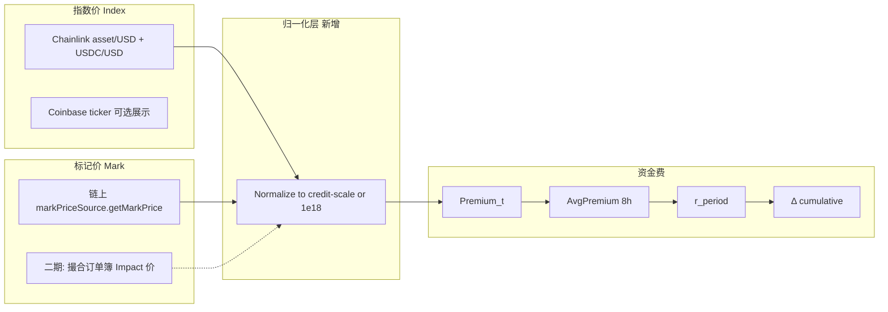
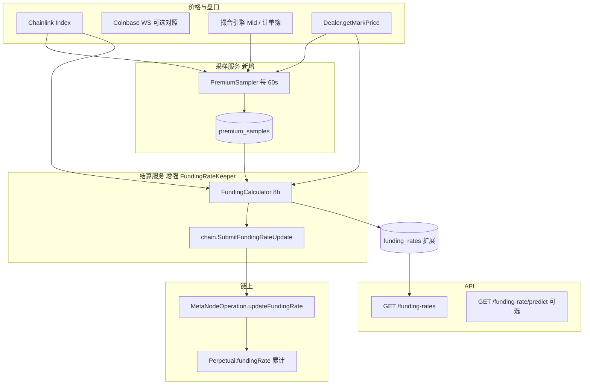

# 永续合约 8 小时资金费 — 实现方案

> 基于 `smart-contract-EVM` 链上合约与 `others/backend` 现有代码整理。  
> 文档版本：2026-06-03（§3 补充 mark/index 计算）

---

## 1. 目标与范围

### 1.1 业务目标

- 每 **8 小时** 对持仓用户结算一次资金费，使永续合约 **标记价** 向 **指数价（现货锚）** 收敛。
- **正资金费率**：多头付、空头收；**负资金费率**：空头付、多头收（与主流 CEX 一致）。
- 链下服务负责 **计算费率 → 调用链上 `updateFundingRate`**；链上负责 **把费率变化反映到每个用户的 `credit`**，无需逐用户转账。

### 1.2 不在本阶段默认范围（可二期）

- 1h / 4h 等非 8h 周期（公式里 N 可变，但需产品确认）。
- 链上可验证的 Premium 采样（当前为 Keeper 信任模型）。
- 用户级资金费账单与链上 `primaryCredit` 的自动划转（MetaNode 把盈亏主要记在 Perp 的 `credit`，平仓时才 `realizePnl`）。

---

## 2. 行业标准：8 小时资金费在做什么

### 2.1 结算时刻（主流 CEX）

| 交易所 | 周期 | 结算时刻 (UTC) |
|--------|------|----------------|
| Binance / OKX / Bybit / Gate | 8h | **00:00、08:00、16:00** |

部分平台在极端行情会改间隔（1h/4h），本方案默认 **N = 8**。

### 2.2 资金费（用户侧）

```
资金费 = 仓位名义价值 × 当期资金费率
仓位名义价值 ≈ |paper| × 标记价   （方向由多空决定收付）
```

- 费率是 **当期 8 小时周期** 的一个百分比（如 +0.01%），不是累计指数本身。
- 结算瞬间 **仍持有仓位** 的用户参与；平仓时机与结算时刻的先后关系各所有细微规则（OKX：结算窗口内成交仍可能计入）。

### 2.3 资金费率（系统侧，Binance / OKX 同类）

**溢价指数（Premium Index）**（每分钟或每 5 秒采样）：

```
Premium = [ max(0, 深度加权买价 − 指数价) − max(0, 指数价 − 深度加权卖价) ] / 指数价
```

**周期内平均溢价（时间加权）**：

```
AvgPremium = (1·P₁ + 2·P₂ + … + n·Pn) / (1 + 2 + … + n)
```

越接近结算时刻权重越大（8h、每分钟采样时 n = 480）。

**利率分量（Interest）**（8h 一次）：

```
I = 0.03% / (24 / N)   →  N=8 时 I = 0.01% / 每 8 小时
```

**当期资金费率**：

```
FundingRate = clamp(
  AvgPremium + clamp(I − AvgPremium, −0.05%, +0.05%),
  floor,
  cap
)
```

- 常见 **cap/floor**：约 **±0.75% / 8h**（因品种、杠杆档而异）。
- **结算用费率**：通常取结算前 **最后一分钟**（或 15:59）算出的预测费率，在 16:00 执行扣付。

### 2.4 与 MetaNode 链上模型的差异（必读）

链上 `Perpetual` 使用 **累计资金指数** `fundingRate`，不是 CEX 展示的「当期费率」：

```solidity
credit = paper.decimalMul(fundingRate) + reducedCredit
// 更新时：newFundingRate 为累计值；实际扣付 = paper × (newRate − oldRate)（decimalMul）
```

要点：

| 维度 | CEX | MetaNode 链上 |
|------|-----|----------------|
| 存储 | 当期 rate % + 历史 | **累计** `fundingRate` |
| 用户扣付 | 名义 × 当期 rate | `paper × ΔfundingRate`（1e18 精度运算） |
| 多空 | 显式收付方向 | Δ>0 多头 credit 增加、空头减少（见 `Perpetual.sol` 注释） |

后端结算时应算出 **本周期 Δ**（或目标 `newCumulative`），再调用 `Dealer.updateFundingRate(perpList, rateList)`。

---

## 3. 合约价格（Mark）与现货指数（Index）的计算

资金费本质上是 **合约成交价相对现货锚价的偏离** 的周期性校正。本节说明：主流 CEX 怎么定义这两个价、MetaNode 链上/后端 **现在实际怎么取数**、以及溢价 `Premium` 怎么从二者算出。

### 3.1 概念对照

| 名称 | 英文 | 含义 | 资金费里的作用 |
|------|------|------|----------------|
| **现货指数价** | Index Price | 一篮子现货/指数成分合成的「公允现货」参考价 | 锚定目标；溢价相对它计算 |
| **合约标记价** | Mark Price | 用于盈亏、清算、资金费的合约公允价 | 代表永续相对现货的偏离 |
| **最新成交价** | Last Price | 撮合最近一笔价格 | 本方案 **不直接** 用于资金费（CEX 也通常用 Mark 而非 Last） |

MetaNode 当前：**链上风控与资金费结算的 mark 都来自链上 `markPriceSource`**；指数价在 **资金费 Keeper 里链下另取**（Chainlink / 回退 mark），与 CEX「盘口深度加权价 vs 指数」相比是 **简化版**。

### 3.2 行业标准：指数价与溢价（CEX）

#### 3.2.1 指数价 Index（现货锚）

各所指数成分不同（现货交易所加权、剔除异常价等），对后端而言通常视为 **外部已算好的标量** `Index_t`（USD/币）。

#### 3.2.2 合约侧用于溢价的「合约价」（非 Last）

Binance / OKX / Gate 等使用 **深度加权影响价**（Impact Bid / Ask），在固定名义（如 200 USDT 冲击量）下从订单簿算买价、卖价，再与指数比较：

```
ImpactBid  = 买入 ImpactMargin 名义时的成交均价
ImpactAsk  = 卖出 ImpactMargin 名义时的成交均价

Premium_t = [ max(0, ImpactBid − Index) − max(0, Index − ImpactAsk) ] / Index
```

直觉：

- 永续整体 **高于** 现货（买盘抬价）→ `ImpactBid > Index` → Premium **为正** → 多头付资金费。
- 永续整体 **低于** 现货 → `ImpactAsk < Index` → Premium **为负** → 空头付资金费。

#### 3.2.3 标记价 Mark（CEX 风控）

CEX 的 Mark 常与 Index 不同，例如 Index + 资金费基差、或 EMA(成交价, Index) 等，用于 **未实现盈亏 / 强平**，不一定等于 Impact 价。  
资金费公式里的「合约侧价格」是 **Impact 价**，不是 Mark 本身。

### 3.3 MetaNode 链上：标记价 Mark 怎么来

每个 `Perp` 在 `Dealer.setPerpRiskParams` 里绑定 `markPriceSource`（实现 `IPriceSource.getMarkPrice()`）。  
`Dealer.getMarkPrice(perp)` → `Liquidation.getMarkPrice` → 该合约 `getMarkPrice()`。

#### 3.3.1 标记价在风控公式中的含义（精度关键）

链上仓位价值（与资金费同一套 `paper` / `credit` 单位）：

```solidity
// Liquidation.getTotalExposure
positionValue = paper.decimalMul(markPrice) + credit
// decimalMul: (paper * markPrice) / 1e18
```

因此 **`markPrice` 不是「每 1 BTC = 30000 × 1e18」这种纯 1e18 美元价**，而是满足：

```
仓位名义（credit 最小单位） = paper × markPrice / 1e18
```

**Sepolia 测试网**（`TestMarkPriceSource`）示例：1 BTC → `paper = 1e18`，$30,000 → `markPrice = 30_000e6`（与 USDC 6 位小数 credit 一致）：

```solidity
// script/DeploySepolia.s.sol
pxBtc.setMarkPrice(30_000e6);   // decimalMul(1e18, 30_000e6) = 30_000e6 ≈ $30,000 USDC 单位
```

**生产向 `OracleAdaptor`**（`src/oracle/OracleAdaptor.sol`）返回 **1e18 精度「每 1 单位标的的 USD 价格」**：

```solidity
// 资产/USDC，1e18 精度
tokenPrice = (asset_USD_raw * 1e8) / usdc_USD_raw;
markPrice  = (tokenPrice * 1e18) / decimalsCorrection;
// 若 BTC = $30,000 → 约为 30_000e18
```

若把 `30_000e18` 直接代入 `decimalMul(1e18, ·)`，名义会变成 `30_000e36/1e18`，与 `30_000e6` 差 **12 个数量级**。  
**结论：资金费实现前必须统一「mark / index 整数口径」**——测试网 `1e6` 对齐 credit、Oracle `1e18` 对齐需在 Keeper 中显式换算（见 §3.3.1）。

#### 3.3.2 测试网 vs 生产价格源

| 环境 | 合约 | Mark 如何更新 |
|------|------|----------------|
| Sepolia 测试 | `TestMarkPriceSource` | 任何人 `setMarkPrice`；部署时写死 30000e6 / 2000e6 |
| 生产（设计） | `OracleAdaptor` | 默认 Chainlink；可选 `setMarkPrice` + `isSelfOracle`（偏离 < `priceThreshold`） |

链上 **没有** 自动把撮合最新价写入 `markPriceSource` 的逻辑；合约 Mark 与订单簿 **脱钩**，除非运维/后端调 `setMarkPrice`（自研 oracle 模式）。

#### 3.3.3 OracleAdaptor 的 Chainlink Mark 计算公式

```
输入：
  rawPrice     = Chainlink(asset/USD).latestRoundData().answer   // 通常 8 位小数
  usdcPrice    = Chainlink(USDC/USD).latestRoundData().answer
  decimalsCorrection = 10^d  （构造参数，如 d=8）

中间：
  tokenPrice = (rawPrice × 1e8) / usdcPrice    // 资产以 USDC 计价
  markPrice  = (tokenPrice × 1e18) / decimalsCorrection

约束：
  block.timestamp - updatedAt ≤ heartbeatInterval（资产、USDC 分别心跳）
```

自定义价开启时：`markPrice = price`（1e18），且 `|price − chainLinkPrice| / chainLinkPrice ≤ priceThreshold`。

### 3.4 MetaNode 后端：现货指数价 Index（三所加权，已实现）

**产品规则**：现货指数参考 **Coinbase、OKX、Binance** 三家现货 last 价，权重 **4 : 3 : 3**；前端/API 字段 `indexPrice` **保留 2 位小数**（如 `"30000.12"`）。

#### 3.4.1 各所价格怎么取

| 交易所 | 配置字段 | WS 订阅 | 使用字段 |
|--------|----------|---------|----------|
| Coinbase | `Markets[].CoinbaseProduct` | `wss://ws-feed.exchange.coinbase.com` channel `ticker` | `price`（美元字符串） |
| Binance | `Markets[].BinanceSymbol` | `wss://stream.binance.com:9443/stream?streams=btcusdt@miniTicker/...` | `data.c`（last） |
| OKX | `Markets[].OkxInstId` | `wss://ws.okx.com:8443/ws/v5/public` channel `tickers` | `data[0].last` |

实现文件：`others/backend/internal/listener/compositespotindex.go`（`SpotIndex.Enabled: true` 时启动）。

#### 3.4.2 加权公式

设某时刻三家最新价为 \(P_{cb}, P_{okx}, P_{bn}\)（美元，>0），权重 \(w_{cb}=4, w_{okx}=3, w_{bn}=3\)：

```
Index_USD = (4·P_cb + 3·P_okx + 3·P_bn) / (4 + 3 + 3)
          = (4·P_cb + 3·P_okx + 3·P_bn) / 10
```

**缺源重归一**：若某所超过 120s 未更新或价格为 0，则从分子分母中剔除该所，其余权重按比例缩放（例如仅 cb、okx 有效 → 权重变为 4:3）。

```go
// internal/listener/spotprice.go — WeightedSpotUSD
```

#### 3.4.3 内部存储 vs 前端展示

| 用途 | 格式 | 示例（BTC ≈ $30,000.12） |
|------|------|-------------------------|
| 资金费 / 链下计算 | `IndexPrice1e6`：美元 × 1e6 的整数字符串 | `"30000120000"` |
| API `indexPrice`、Supabase `market_quotes.price_usd` | `IndexPriceDisplay`：**2 位小数** | `"30000.12"` |

```go
// internal/logic/market/indexprice.go — applyIndexPrice 优先 Display
```

#### 3.4.4 配置示例（`etc/metanode.yaml`）

```yaml
SpotIndex:
  Enabled: true
  CoinbaseWeight: 4
  OkxWeight: 3
  BinanceWeight: 3

Markets:
  - Name: BTC-PERP
    CoinbaseProduct: "BTC-USD"
    BinanceSymbol: "BTCUSDT"
    OkxInstId: "BTC-USDT"
```

`SpotIndex.Enabled: true` 时由 **CompositeSpotIndex** 统一订阅三所；`Coinbase.Enabled` 可设为 `false` 避免重复连接。

#### 3.4.5 资金费 Keeper 如何用 Index

优先级（`fundingratekeeper.indexPrice`）：

1. **CompositeSpotIndex** 的 `IndexPrice1e6`（与 mark 同为 1e6 口径时可直接算 premium）  
2. 回退：Chainlink `answer × 10^10`（1e18 口径，需与 mark 归一化后再算）  
3. 再失败：链上 `getMarkPrice`

#### 3.4.6 与 Chainlink 的关系

Chainlink 仍可用于链上 Oracle / 应急；**默认现货指数展示与资金费指数**以三所加权为准。若需改权重，只改 `SpotIndex.*Weight`，不必改合约。

### 3.5 MetaNode 后端：合约价 Mark 怎么来（资金费）

```go
// internal/engine/fundingratekeeper.go
mark, _ := chain.GetMarkPrice(ctx, perp)   // eth_call Dealer.getMarkPrice → 链上 markPriceSource
```

即：**资金费里的「合约价」= 链上标记价**，不是：

- 撮合引擎订单簿中间价；
- Coinbase 现货 ticker；
- 用户 last trade。

撮合成交价只影响订单 `creditAmount/paperAmount` 的隐含价格，**不会自动回写** `TestMarkPriceSource` / `OracleAdaptor`。

### 3.6 溢价 Premium 与当期费率（本项目：现状 vs 目标）

#### 3.6.1 现状（`fundingDelta`，简化版）

Keeper 在结算瞬间各取 **一个** mark、index，直接算（Go `big.Int`）：

```
premium = (mark − index) × 1e18 / index     // index=0 时返回 0
delta   = premium / 3                       // 隐含「日溢价分 3 次 8h」
delta   = clamp(delta, −MaxRate, +MaxRate)
newFundingRate_cumulative = oldFundingRate_cumulative + delta
```

与 CEX 差异：

| 项 | CEX | MetaNode 现状 |
|----|-----|----------------|
| 合约侧价格 | Impact Bid/Ask 深度加权 | **单点 mark** |
| 现货锚 | 指数成分 | **Chainlink（或 mark 回退）** |
| 时间维度 | 8h 内 480/5760 次加权 | **结算一刻快照** |
| 与 8h 费率关系 | 明确 `FundingRate` % | `premium/3` 启发式 + 累计指数 |

**精度风险**：测试网 `mark = 30000e6`；若资金费仍走 Chainlink `index = 30000e18` 会失真。启用 **SpotIndex 三所加权** 后 index 亦为 **1e6 口径**（`30000120000`），与 mark 一致。未开 SpotIndex 时仍需手动归一化 mark/index。

#### 3.6.2 目标（对齐 §2.3，需产品确认）

**步骤 A — 采样（每 60s）**

```
Index_t  = 归一化后的指数价（推荐：Chainlink 与链上 Oracle 同源公式，或 Coinbase→换算到 mark 口径）
Mark_t   = 归一化后的链上 getMarkPrice（或二期：订单簿 Impact 价）

Premium_t = (Mark_t − Index_t) × 1e18 / Index_t
// 若采用 CEX 完整公式，改为 §3.2.2 的 ImpactBid/Ask
```

**步骤 B — 8h 加权**

```
AvgPremium = Σ(i × Premium_i) / Σ(i)    , i = 1..n
```

**步骤 C — 资金费率 %**

```
r_period = clamp(AvgPremium + clamp(I − AvgPremium, ±0.05%), floor, cap)
```

**步骤 D — 转为链上累计增量 Δ**

使持仓满足：`decimalMul(paper, Δ) ≈ sign(paper) × |paper|×Mark/1e18 × r_period`（见 §6.4）。

### 3.7 数值示例（统一口径后）

假设已把 mark、index 都换算为 **与 Sepolia 一致**：BTC $30,000 → `30000e6`，`paper = 1e18`（1 BTC 多头）。

| 场景 | mark | index | premium（约） | 含义 |
|------|------|-------|---------------|------|
| 合约溢价 | `30030e6` | `30000e6` | `(30030−30000)×1e18/30000e6 ≈ 0.001`（0.1%） | 多头付资金费 |
| 合约折价 | `29970e6` | `30000e6` | ≈ −0.001 | 空头付资金费 |
| 贴现货 | `30000e6` | `30000e6` | 0 | 仅受 Interest 分量影响 |

若 index 误用 `30000e18`、mark 仍为 `30000e6`，则 `premium` 数量级错误，**资金费会失真**——这是当前测试网配置下最优先要修的对齐项。

### 3.8 推荐价格管线（实现目标）



**建议默认（P0）**：

- **Index**：与 `OracleAdaptor.getChainLinkPrice()` 相同公式，在链下复算；或 `eth_call` 只读 Oracle 合约。
- **Mark**：`Dealer.getMarkPrice`；测试网定期 `setMarkPrice` 跟随 Chainlink/Coinbase 中位数，避免 mark≪index 量级差。
- **展示 API**：`indexPrice` 继续可用 Coinbase 1e6；**资金费计算**走单独 `indexFunding` 字段，避免与展示混用。

---

## 4. 现有实现盘点

### 4.1 链上（已实现）

| 组件 | 说明 |
|------|------|
| `Perpetual.fundingRate` | 累计指数；变更自动影响所有持仓 `credit` |
| `MetaNodeOperation.updateFundingRate` | 批量更新，仅 `fundingRateKeeper` |
| `Operation.updateFundingRate` | 遍历 `perpList` 写各 Perp |
| `MetaNodeView.getFundingRate` | 查询接口 |

权限：`state.fundingRateKeeper`（`MetaNodeStorage.onlyFundingRateKeeper`）。

### 4.2 后端（骨架已有，算法与产品未对齐）

**入口**：`metanode.go` 启动 `engine.FundingRateKeeper`。

**配置**（`etc/metanode.yaml`）：

```yaml
FundingRate:
  SettleInterval: 28800   # 8 小时（秒）
  MaxRate: "0.001"        # 注释为 0.1%，实际用作 delta 上限（见下）
```

**当前结算逻辑**（`internal/engine/fundingratekeeper.go`）概要：

1. `ticker` 按 `SettleInterval` 触发（**进程启动时刻对齐，非 UTC 0/8/16**）。
2. 读链上 `oldRate = GetFundingRate(perp)`。
3. `mark = Dealer.getMarkPrice(perp)`，`index = Chainlink`（失败则回退 mark）。
4. `premium = (mark - index) * 1e18 / index`。
5. `delta = premium / 3`（隐含「日溢价分三次 8h」），再被 `MaxRate` 夹紧。
6. `newRate = old + delta`，`SubmitFundingRateUpdate` 上链。
7. 写入 Postgres `funding_rates`（累计 rate、mark、index、settle_time）。

**缺口**：

| 项 | 状态 |
|----|------|
| 8h UTC 定点结算 | ❌ 使用相对 ticker |
| Premium 时间加权平均 | ❌ 单次 mark/index 快照 |
| Interest 分量 + 0.05% clamp | ❌ |
| 当期 rate / 预测 rate 展示 | ❌ DB 只存累计值 |
| `GET /funding-rates` | ❌ logic 仍为 todo |
| 启动校验 `fundingRateKeeper` | ❌ 仅校验 `validOrderSender` |
| Premium 采样表 | ❌ |
| 结算失败重试 / 幂等 | ❌ |
| 用户预估下一期资金费 | ❌ |

### 4.3 已有数据表

```sql
funding_rates (perp, rate, mark_price, index_price, settle_time)
```

可扩展列见 §7。

---

## 5. 目标架构



### 4.1 进程划分建议

| 模块 | 职责 | 改造方式 |
|------|------|----------|
| `PremiumSampler` | 周期采样 Premium、写库/Redis | 新 goroutine，与 Keeper 同进程或独立 worker |
| `FundingRateKeeper` | UTC 触发、算 Δ、上链、写历史 | 重构 `fundingratekeeper.go` |
| `FundingCalculator` | 纯函数：AvgPremium + I + clamp → periodRate、Δ | 新包 `internal/funding/` |
| `ListFundingRatesLogic` | 分页历史 + 最新一期 rate | 补全 todo |

---

## 6. 核心算法设计（推荐路径）

### 6.1 配置项扩展（`FundingRateConfig`）

```yaml
FundingRate:
  SettleInterval: 28800
  SettleHoursUTC: [0, 8, 16]      # 定点结算
  SampleIntervalSec: 60           # Premium 采样
  InterestRatePer8h: "0.0001"       # 0.01% = 1e14 @ 1e18，需与链上精度统一
  ClampAroundInterest: "0.0005"   # ±0.05%
  CapPer8h: "0.0075"              # +0.75%
  FloorPer8h: "-0.0075"
  # 用于链上累计增量的上限（与 period cap 区分）
  MaxCumulativeDelta: "..."       
```

### 6.2 Premium 采样

每个市场、每个采样点 `t`：

```
indexPrice  = Chainlink(market)   // 与现 indexPrice 一致
markPrice   = Dealer.getMarkPrice(perp)  // 或 (bid+ask)/2
premium_t   = (mark - index) * 1e18 / index   // 与现 fundingDelta 分子一致；可升级为盘口深度加权
```

存入 `premium_samples(perp, ts, premium, mark, index)`，保留 **当前周期 + 上一周期** 即可（约 480～960 行/市场）。

### 6.3 周期结束时计算 **当期资金费率** `r_period`

```go
avgPremium := weightedAverage(samples in [lastSettle, now))
inner := clamp(interestRate - avgPremium, -clamp05, +clamp05)
rPeriod := clamp(avgPremium + inner, floor, cap)
```

与 Gate/Binance 在 **N=8** 时 `(8/N)=1`，不再除 3（**删除现 `premium/3` 逻辑**）。

### 6.4 累计指数增量 `Δ`（对齐链上 `decimalMul`）

需把 **百分比费率** 转为链上累计指数的一步增量，使用户资金费 ≈ **名义 × r_period**。

记：

- `paper` 单位为 1e18（1 BTC = 1e18）。
- `mark` 与 `credit` 小数位一致（USDC 6 位：30000 USD = `30000e6`；标记价若为 1e18 需统一换算）。

**推荐推导**（实现前用单测锁死）：

```
notional = |paper| * mark / PAPER_UNIT   // PAPER_UNIT = 1e18
fee      = notional * r_period            // r_period 为有理数，用 big.Rat 或定点
Δ        = fee * PAPER_UNIT / |paper|    // 使 decimalMul(paper, Δ) = sign(paper)*fee
```

对 **纯多头 paper>0**：`decimalMul(paper, Δ) = paper * Δ / 1e18`，令其为 `fee`（credit 精度）。

> **实现前必须做一次链上读数 + 本地公式对照单测**（BTC-PERP 1 张、mark=30000、r=0.01%），避免 mark/index 精度不一致导致差 1e6 量级。

### 6.5 上链

```go
old := GetFundingRate(perp)
new := old + Δ
SubmitFundingRateUpdate([]perp{...}, []new{...})
```

写入 `funding_rates` 时建议同时存：

- `cumulative_rate`（= new）
- `period_rate`（= r_period，前端展示）
- `delta`（= Δ）
- `avg_premium`、`samples_count`

### 6.6 调度：UTC 定点 + 容差

- 使用 `time.Ticker` + **下一次 UTC 0/8/16** 的 `time.Timer`，不要用「启动后每 8h」。
- 允许 **±15s** 操作容差（参考 Binance 规则文档）。
- 结算使用 **结算前最后一分钟** 的预测费率（可在 07:59 算好 `r_period`，08:00:00 上链）。

伪代码：

```go
func nextSettleUTC(now time.Time, hours []int) time.Time { ... }

func (k *FundingRateKeeper) schedule() {
  for {
    t := nextSettleUTC(time.Now().UTC(), k.config.SettleHoursUTC)
    time.Sleep(time.Until(t))
    k.settleFundingRate(useRateComputedAt(t.Add(-time.Minute)))
  }
}
```

### 6.7 权限与运维

- 配置私钥地址必须等于链上 `fundingRateKeeper`（启动时 `eth_call` 读 `Dealer` / `Storage` 校验，失败则 **只读运行 + 告警**）。
- 可与撮合 `validOrderSender` **分钥**：`FundingRate.PrivateKey` 可选，缺省回退 `Ethereum.PrivateKey`。
- 上链失败：指数退避重试；同一 `settle_id`（perp + period_start）幂等，避免重复加价。

---

## 7. 数据模型扩展

### 7.1 `premium_samples`（新表）

| 字段 | 类型 | 说明 |
|------|------|------|
| perp | varchar(42) | 合约地址 |
| ts | timestamptz | 采样时间 UTC |
| premium | text | 定点/字符串大数 |
| mark_price | text | |
| index_price | text | |

索引：`(perp, ts DESC)`；定期清理 `ts < now() - 16h`。

### 7.2 `funding_rates`（扩展）

在现有字段上增加：

| 字段 | 说明 |
|------|------|
| period_rate | 当期 8h 费率（展示用，如 0.0001） |
| delta | 本周期累计指数增量 |
| avg_premium | 周期内平均溢价 |
| tx_hash | 结算交易 |
| period_start / period_end | 周期边界 UTC |

### 7.3 Redis（可选）

- `funding:predict:{perp}`：实时预测费率（每分钟刷新）。
- `funding:last_settle:{perp}`：上次成功结算时间，用于幂等。

---

## 8. API 与前端

### 8.1 补全 `GET /funding-rates`

实现 `ListFundingRatesLogic`：

- 参数：`perp`, `page`, `pageSize`
- 返回：`FundingRateRecord` 增加 `periodRate`, `delta`, `txHash`（扩展 types + swagger 后 `goctl` 生成）

### 8.2 建议新增（二期）

| 接口 | 说明 |
|------|------|
| `GET /funding-rate/latest?perp=` | 最新一期 + 下一期预测 |
| `GET /funding-rate/preview?trader=&perp=` | 若持仓，预估下期支付（读 paper + predict rate） |

### 8.3 市场接口

`listmarkets` / `getmarket` 已读链上累计 `FundingRate`；建议改为：

- `fundingRate`：最近一期 **period_rate**（人类可读 %）
- `nextFundingTime`：UTC 时间戳
- `predictedFundingRate`：可选

Ticker WS 可推送 `fundingRate` / `nextSettle`（与 `ws_ticker.go` 一并改）。

---

## 9. 用户资金费与风控展示

链上结算后，用户 **Perp.credit** 已变，**保证金账户 primaryCredit 不变**，直到平仓 `realizePnl`。

前端 / `getriskinfo` 应用 **mark + funding 后的 credit** 展示未实现盈亏（链上 `getTraderRisk` 已含 Perp 侧逻辑时需确认 View 是否包含 funding 效应）。

建议在方案落地时：

1. 读 `Perpetual.balanceOf(trader)` 的 `credit`（已含累计 funding）。
2. 文档说明：资金费不是单独 USDC 转账，而是 **仓位记账**。

---

## 10. 实施阶段

| 阶段 | 内容 | 产出 |
|------|------|------|
| **P0** | 确认 §11 产品参数；mark/index 口径单测 | 参数表 + 单测向量 |
| **P1** | UTC 调度 + 删除 `/3` + Interest/clamp/cap + Keeper 校验 | 可上测试网 |
| **P2** | Premium 采样表 + 加权平均 | 与 Binance 曲线接近 |
| **P3** | DB 扩展 + `ListFundingRates` + 市场字段 | 前端可展示历史 |
| **P4** | 分钥、幂等、监控告警、预测 API | 生产就绪 |

---

## 11. 待你确认的产品参数（请逐项回复）

以下决定会直接影响公式与表结构，请确认或给出你们自己的规则：

1. **结算时刻**  
   - [ ] 采用 UTC **00:00 / 08:00 / 16:00**  
   - [ ] 其他时区或时刻：__________

2. **费率公式**  
   - [ ] 对齐 Binance/OKX（AvgPremium + Interest + 双层 clamp + cap/floor）  
   - [ ] 简化版：单点 `(mark-index)/index` 作为当期费率（无 8h 加权）  
   - [ ] 其他：__________

3. **现货指数 Index**（详见 §3.4，**已实现 4:3:3**）  
   - [x] Coinbase + OKX + Binance 加权，权重 4:3:3，API 2 位小数  
   - [ ] 调整权重（若非 4:3:3）  
   - [ ] mark 仍用链上；或 mark 改订单簿 Impact 价  

4. **采样粒度**  
   - [ ] 每 **60s**（n=480/8h，与 OKX 文档一致）  
   - [ ] 每 **5s**（n=5760，与 Binance PDF 一致）  

5. **利率分量 I（每 8h）**  
   - [ ] **0.01%**（0.03%/天）  
   - [ ] **0**（无固定利率）  
   - [ ] 其他：__________

6. **费率上下限（每 8h）**  
   - [ ] **±0.75%**  
   - [ ] **±0.1%**（与现 yaml `MaxRate: 0.001` 接近）  
   - [ ] 其他：__________

7. **链上累计 Δ 与展示 rate 的关系**  
   - 是否要求：用户 8h 资金费 = `|仓位名义| × period_rate` **精确到 1 USDC 最小单位**？  
   - [ ] 是（需按 §6.4 做单测对齐）  
   - [ ] 否，允许小幅舍入误差  

8. **Keeper 密钥**  
   - [ ] 与撮合共用 `Ethereum.PrivateKey`  
   - [ ] 独立 `FundingRate.PrivateKey`（推荐生产）  

9. **结算失败策略**  
   - [ ] 重试直到成功（可能推迟几分钟）  
   - [ ] 跳过本周期并告警  
   - [ ] 人工介入  

10. **历史数据**  
    - 是否需要从某日期 **回填** 资金费记录？  
    - [ ] 否，从现在开始  
    - [ ] 是，回填规则：__________

---

## 12. 参考

- OKX：[Perpetual funding fee mechanism](https://www.okx.com/en-us/help/perps-funding-fee-mechanism)  
- Gate：[Funding rate explanation](https://www.gate.com/help/futures/futures-logic/27569/contract-funding-rate-and-funding-fee-explanation)  
- 本项目链上：`src/Perpetual.sol`、`src/libraries/Operation.sol`  
- 本项目后端：`others/backend/internal/engine/fundingratekeeper.go`  
- 仓位与 funding 存储说明：`others/docs/Position_Storage_And_Trading.md`

---

## 13. 小结

- **链上已具备**「累计指数 + 批量更新」的结算能力，适合 8h 一次批量调整全体持仓 `credit`。  
- **后端已有** `FundingRateKeeper` 与落库，但当前是 **简化溢价 / 相对 8h 定时 / 无加权与 Interest**，与主流 8h 规则和产品展示仍有明显差距。  
- **推荐落地顺序**：先确认 §11 参数 → **统一 mark/index 口径（§3）** → UTC 定点 + `r_period` 与 Δ → Premium 采样与加权 → API/前端展示。

确认 §11 后，可按 **P0→P1** 直接改 `fundingratekeeper.go` 与配置结构，并补全 `listfundingrateslogic.go`。
